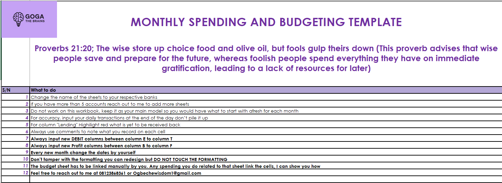

# Monthly Spending & Budgeting Template (Excel Dashboard)

This project is an Excel-based **Monthly Spending and Budgeting Template** designed to help users track expenses, monitor income, and understand spending habits across multiple accounts. It consolidates transactions into a summary dashboard that makes it easy to evaluate **monthly performance**, identify overspending categories, and improve financial planning.

The template supports **budget forecasting**, **actual tracking**, and **visual insights** through charts and summary metrics.

---

## 📌 Key Features
- Monthly spending tracking across multiple categories
- Budget planning (Projected vs Actual)
- Spending summary & analytics dashboard
- Automatic totals and calculations
- Clear user instructions for accurate tracking

---

## 🛠 Tools Used
- Microsoft Excel  
- Spreadsheet modelling (formulas, formatting, charts, dashboards)

---

## 📷 Project Screenshots

### ✅ Instructions Sheet
> This page guides users on how to properly use the workbook, manage sheets, and ensure accurate monthly tracking.

---

### ✅ Personal Monthly Budget Sheet
> A budgeting section showing **projected income**, **actual income**, expected expenses, and balance differences.

---

### ✅ Spending Dashboard / Monthly Summary
> A dashboard view highlighting **monthly totals**, category-level spending trends, and visual charts for quick insights.

---

## 📂 File Included
- `Spending Template Main Model_VF.xlsx`

---

## 🚀 How To Use
1. Open the Excel file.
2. Go to **INSTRUCTIONS** sheet and read the guide.
3. Enter daily transactions in the appropriate spending categories.
4. Monitor your spending on the **Dashboard** sheet.
5. Use the **Budget** sheet to compare projected vs actual spending.

---

## 📈 Insights You Can Generate
- Monthly income vs total expenses
- Most expensive categories
- Transfers, savings, repayments tracking
- Spending patterns over time
- Budget accuracy analysis (Projected vs Actual)

---

## 👤 Author
**Ogbeche Wisdom**  
Data Analyst | SQL • Power BI • Tableau • Python
